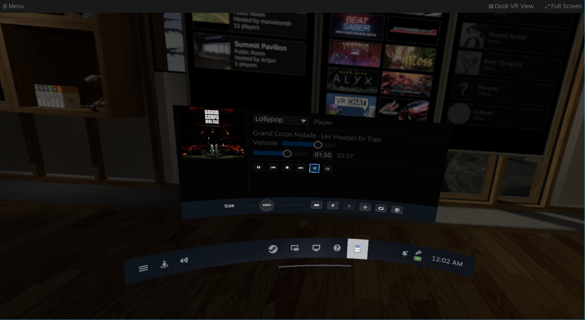

# mpris-openvr-overlay

Control and view the state of media players from the SteamVR/OpenVR dashboard.

This is mostly for when I put on my VR headset and realize I forgot to mute
something but would rather not take it off (especially if I'm streaming to a
standalone headset in a different room).



## Usage

```sh
cargo run --release
```

## Autostart

From the repository directory, with SteamVR already running:

```sh
g++ install.cpp `pkg-config openvr --cflags --libs` -o install && ./install
```

will install a manifest that allows you to automatically start the overlay by
selecting it in the SteamVR startup settings. 

## License

MIT (mostly because of the SteamVR dependency)
